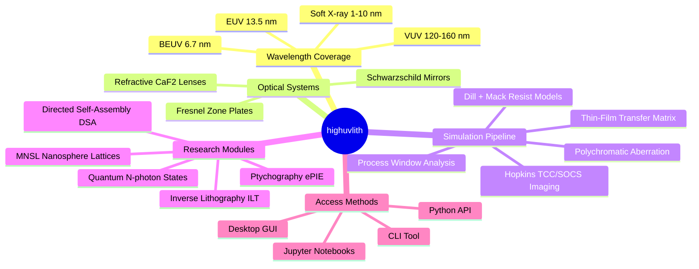
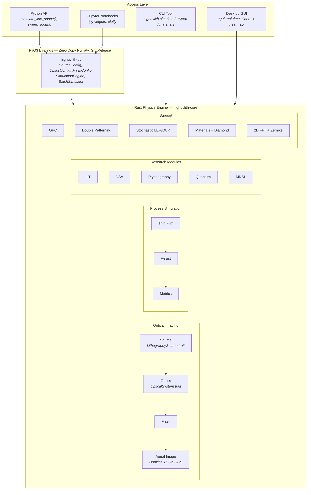
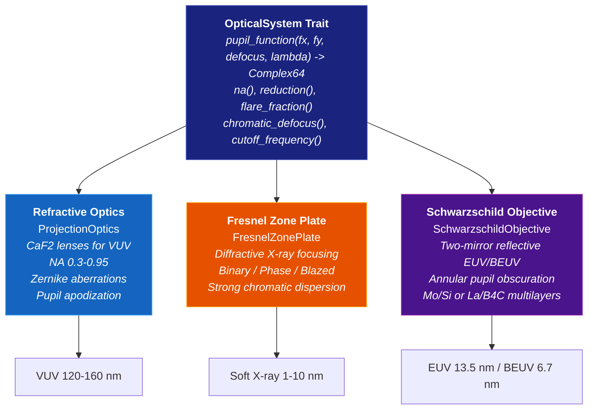
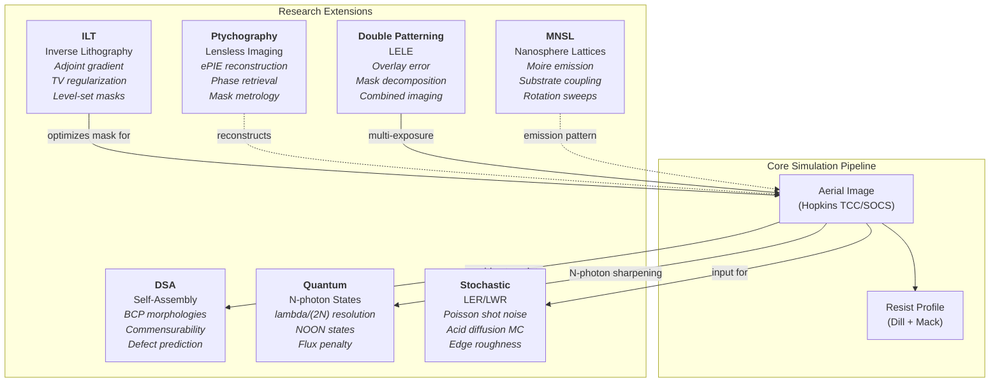
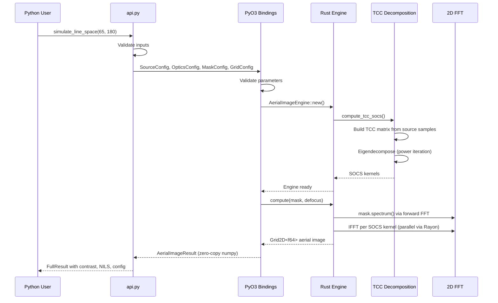
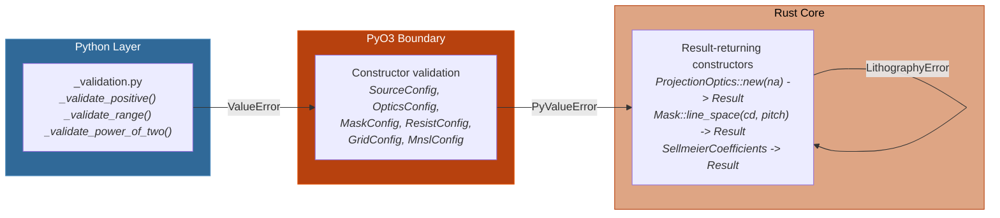

# highuvlith

High-performance lithography simulation framework spanning VUV through X-ray wavelengths.

[](https://github.com/martinpeck/highuvlith/actions/workflows/ci.yml)
[](https://pypi.org/project/highuvlith/)
[](LICENSE)

Highuvlith simulates the full optical lithography pipeline from VUV (120-160 nm) through EUV (13.5 nm) to soft X-ray (1-10 nm), with pluggable optical systems, advanced research modules, and diamond substrate support. The Rust physics engine delivers parallel, GIL-free computation accessible via Python API, CLI, desktop GUI, and Jupyter notebooks.

---

## Capabilities at a Glance



## Architecture

The codebase follows a layered architecture: a Rust physics engine at the core, PyO3 bindings for zero-copy interop, and four user-facing access methods.



## Simulation Pipeline

Every simulation follows a single pipeline from illumination source through to lithographic metrics. Each stage is modular and configurable.

```mermaid
graph LR
    A["Source<br/><i>F2 157nm, Ar2 126nm,<br/>synchrotron, XFEL</i>"] --> B["Optical System<br/><i>Refractive lens,<br/>zone plate,<br/>Schwarzschild</i>"]
    B --> C["Mask Spectrum<br/><i>2D FFT of transmittance<br/>Binary / AttPSM / AltPSM</i>"]
    C --> D["TCC Decomposition<br/><i>Eigendecompose into<br/>SOCS kernels</i>"]
    D --> E["Aerial Image<br/><i>Sum of coherent<br/>kernel convolutions</i>"]
    E --> F["Thin Film<br/><i>Transfer matrix,<br/>standing waves</i>"]
    F --> G["Resist Exposure<br/><i>Dill ABC model,<br/>latent image</i>"]
    G --> H["PEB + Development<br/><i>Mack model,<br/>resist profile</i>"]
    H --> I["Metrics<br/><i>CD, NILS, contrast,<br/>DOF, EL</i>"]

    style A fill:#e65100,stroke:#ff9800,color:#fff
    style B fill:#4a148c,stroke:#9c27b0,color:#fff
    style D fill:#1565c0,stroke:#42a5f5,color:#fff
    style E fill:#1565c0,stroke:#42a5f5,color:#fff
    style H fill:#2e7d32,stroke:#66bb6a,color:#fff
    style I fill:#6a1b9a,stroke:#ab47bc,color:#fff
```



## Pluggable Optical Systems

The `OpticalSystem` trait enables the same aerial image engine to work with refractive lenses, diffractive zone plates, and reflective objectives spanning VUV through X-ray wavelengths.



The `LithographySource` trait similarly abstracts illumination sources -- from VUV excimer lasers to X-ray synchrotrons and XFELs. Source wavelength automatically determines photon energy and shot noise characteristics.

## Research Module Interactions

Six research modules extend the core pipeline. Each feeds into or consumes the aerial image engine, enabling combined workflows such as ILT-optimized masks with stochastic LER analysis.



## Data Flow: Python API to Rust Engine

This diagram traces a single simulation from Python function call through the Rust engine and back to a Python result object.



## Access Methods

```mermaid
graph TB
    U((User)) --> P["Python API"]
    U --> C["CLI"]
    U --> G["Desktop GUI"]
    U --> J["Jupyter"]

    P --> P1["simulate_line_space(65, 180)<br/><i>One-liner convenience</i>"]
    P --> P2["SimulationEngine + BatchSimulator<br/><i>Full control, parameter sweeps</i>"]
    P --> P3["viz.plot_aerial() / plotly<br/><i>Static and interactive plots</i>"]

    C --> C1["highuvlith simulate --config sim.toml<br/><i>Aerial image -> JSON or PNG</i>"]
    C --> C2["highuvlith sweep --focus-range -200,200,21<br/><i>Process window with progress bar</i>"]
    C --> C3["highuvlith materials --wavelength 157<br/><i>Query optical constants</i>"]

    G --> G1["Real-time parameter sliders<br/><i>lambda, NA, sigma, CD, pitch, focus</i>"]
    G --> G2["Live aerial image heatmap<br/><i>Background compute thread</i>"]

    J --> J1["interactive_aerial()<br/><i>6-slider live explorer</i>"]
    J --> J2["interactive_focus_sweep()<br/><i>Contrast vs focus curve</i>"]

    style U fill:#f0a030,stroke:#f0a030,color:#1a1a2e
    style P fill:#1565c0,stroke:#42a5f5,color:#fff
    style C fill:#2e7d32,stroke:#66bb6a,color:#fff
    style G fill:#6a1b9a,stroke:#ab47bc,color:#fff
    style J fill:#e65100,stroke:#ff9800,color:#fff
```



## Features

### Core Optical Simulation

| Feature | Description |
|---------|-------------|
| **Aerial Image (SOCS)** | Hopkins partially-coherent imaging with TCC eigendecomposition and parallel kernel convolution |
| **Polychromatic Imaging** | Spectral integration accounting for chromatic aberration (CaF2 at VUV, zone plate at X-ray) |
| **Illumination Shapes** | Conventional, annular, quadrupole, and dipole source pupil configurations |
| **Zernike Aberrations** | Fringe-indexed wavefront error through high-order terms (extended table to index 48) |
| **Pupil Apodization** | Uniform, quadratic, and Gaussian transmission profiles |
| **Zone Plate Optics** | Fresnel diffractive focusing with binary/phase/blazed efficiency and central stop |
| **Schwarzschild Objective** | Two-mirror reflective system for EUV/BEUV with annular pupil and configurable obscuration |

### Process Simulation

| Feature | Description |
|---------|-------------|
| **Thin-Film Optics** | Transfer matrix method for multilayer stacks -- reflectance, standing waves, Brewster angle |
| **Resist Modeling** | Dill ABC exposure kinetics + Mack development model with PEB acid diffusion |
| **Process Window** | Dose-focus sweeps with DOF, exposure latitude, and Bossung curve extraction |
| **OPC** | Rule-based and model-based optical proximity correction with polygon edge biasing |
| **Double Patterning** | LELE simulation with overlay error modeling and complementary mask decomposition |
| **Stochastic Effects** | Photon shot noise (Poisson) and acid diffusion Monte Carlo for LER/LWR prediction |

### Research Modules

| Module | Description |
|--------|-------------|
| **Inverse Lithography (ILT)** | Gradient-based mask optimization via adjoint method with total variation regularization |
| **Directed Self-Assembly (DSA)** | Block copolymer assembly -- lamellar, cylindrical, spherical morphologies with commensurability checking and defectivity modeling |
| **Ptychography (CDI)** | Extended Ptychographic Iterative Engine (ePIE) for lensless coherent diffraction imaging and mask metrology |
| **Quantum Lithography** | N-photon entangled NOON state imaging -- effective lambda/(2N) resolution with fidelity and flux modeling (theoretical) |
| **MNSL** | Moire Nanosphere Lithographic Reflection -- nanosphere array coupling, rotation/separation sweeps, substrate coupling, and emission pattern analysis |

### Materials Database

| Material | Type | Wavelength Range |
|----------|------|-----------------|
| CaF2, MgF2, LiF, BaF2, SiO2 | Sellmeier dispersion | 130 nm - 10 um |
| Diamond (C) | Sellmeier dispersion | 225 nm - far IR |
| Cr, Si | Tabulated n,k | 126 - 160 nm |
| AlF3, Na3AlF6, LaF3, GdF3 | Tabulated n,k | VUV coatings |
| VUV fluoropolymer, BARC | Tabulated n,k | Resist/ARC |

Diamond substrate modeling includes thermal properties (2200 W/m-K conductivity), X-ray transmission calculations, and resist-on-diamond / diamond-on-silicon film stack presets.

### Visualization & Output

| Feature | Description |
|---------|-------------|
| **Matplotlib** | Aerial image heatmaps, cross-sections, Bossung curves, ED windows, resist profiles, MNSL emission patterns |
| **Plotly** | Interactive heatmaps with hover, interactive Bossung curves |
| **Image Export** | PNG and TIFF with 4 colormaps (Inferno, Grayscale, BlueRed, Viridis) |
| **Video** | Demo animation generator producing VP9 (.webm) and MPEG-4 (.mp4) |
| **Serialization** | TOML configs, NPZ results |

## Input Validation & Robustness

All constructors validate parameters at creation time and return descriptive errors. The validation is layered across three boundaries:



Examples of validated parameters:
- **Numerical aperture**: must be in (0, 1)
- **Wavelength**: must be positive
- **Mask geometry**: CD must be positive and less than pitch
- **Resist model**: Mack selectivity n > 1 (singularity guard at n=1)
- **Sellmeier dispersion**: resonance singularity detection
- **Grid dimensions**: must be positive power-of-two

## Installation

```bash
pip install highuvlith
```

Optional extras:

```bash
pip install highuvlith[viz]         # matplotlib plots
pip install highuvlith[interactive] # plotly + polars
pip install highuvlith[notebook]    # Jupyter ipywidgets
pip install highuvlith[all]         # everything
```

Build from source:

```bash
git clone https://github.com/martinpeck/highuvlith.git
cd highuvlith
python -m venv .venv && source .venv/bin/activate
pip install maturin numpy
maturin develop
```

## Quick Start

### Python -- One-Liner

```python
import highuvlith as huv

result = huv.simulate_line_space(65.0, 180.0, na=0.75, with_resist=True)
print(f"Contrast: {result.contrast:.3f}, NILS: {result.nils:.2f}")
```

### Python -- Full Control

```python
import highuvlith as huv

source = huv.SourceConfig.f2_laser(sigma=0.7)
optics = huv.OpticsConfig(numerical_aperture=0.85)
mask = huv.MaskConfig.line_space(cd_nm=45.0, pitch_nm=120.0)
grid = huv.GridConfig(size=512, pixel_nm=1.0)

engine = huv.SimulationEngine(source, optics, mask, grid=grid)
aerial = engine.compute_aerial_image(focus_nm=0.0)

print(f"Contrast: {aerial.image_contrast():.4f}")

# Inspect engine configuration
print(f"Source: {engine.source.wavelength_nm}nm")
print(f"Optics: NA={engine.optics.numerical_aperture}")
print(f"Grid: {engine.grid.size}x{engine.grid.size}")

# Focus sweep
sweep = huv.sweep_focus(cd_nm=65.0, pitch_nm=180.0, na=0.75)
print(f"Best focus: {sweep['best_focus_nm']:.0f} nm")
print(f"Peak contrast: {sweep['best_contrast']:.3f}")
```

### CLI

```bash
# Compute aerial image and export as PNG
highuvlith simulate --config examples/sim.toml --output aerial.png

# Process window sweep with progress bar
highuvlith sweep --config examples/sim.toml --focus-range="-300,300,21"

# Query VUV materials database
highuvlith materials --wavelength 157
```

### Desktop GUI

```bash
cargo run -p highuvlith-gui
```

## VUV-Specific Physics

VUV lithography (120-160 nm) operates in a regime with unique constraints:

- **CaF2-only optics** -- no achromatization partner exists; laser bandwidth causes image blur via axial chromatic aberration. Polychromatic simulation is essential.
- **Vacuum environment** -- O2 absorbs strongly below 185 nm. All beam paths require vacuum or N2 purge. No pellicle is possible.
- **Fluoropolymer resists** -- conventional resists are opaque at 157 nm. Specialized fluorinated backbones with very low Dill-A, moderate Dill-B.
- **7.9 eV photon energy** -- different photochemistry pathways vs 6.4 eV at 193 nm DUV.
- **Steep CaF2 dispersion** -- dn/dlambda near the absorption edge makes chromatic effects severe.

## Project Structure

```
highuvlith/
  Cargo.toml                         # Workspace: 4 Rust crates
  pyproject.toml                     # Maturin build + Python config
  crates/
    highuvlith-core/                 # Rust physics engine (21 modules)
      src/
        aerial.rs                    #   Hopkins TCC/SOCS aerial imaging
        source.rs                    #   LithographySource trait + VUV lasers
        optics/                      #   OpticalSystem trait + implementations
          mod.rs                     #     Trait definition + refractive optics
          zone_plate.rs              #     Fresnel zone plate (X-ray)
          schwarzschild.rs           #     Schwarzschild objective (EUV/BEUV)
        mask.rs                      #   Mask geometry + spectrum
        thinfilm.rs                  #   Transfer matrix thin-film
        resist.rs                    #   Dill exposure + Mack development
        process.rs                   #   Process window analysis
        opc.rs                       #   Optical proximity correction
        metrics.rs                   #   CD, NILS, contrast, MTF
        stochastic.rs                #   Shot noise + LER/LWR Monte Carlo
        double_patterning.rs         #   LELE double patterning
        ilt.rs                       #   Inverse lithography (adjoint)
        dsa.rs                       #   Directed self-assembly
        ptychography.rs              #   ePIE coherent diffraction imaging
        quantum.rs                   #   Quantum lithography (NOON states)
        mnsl.rs                      #   Moire nanosphere lattices
        materials/                   #   Optical constants database
          database.rs                #     VUV materials (CaF2, Si, Cr, ...)
          dispersion.rs              #     Sellmeier dispersion models
          diamond.rs                 #     Diamond substrate + X-ray window
          energy.rs                  #     eV <-> nm conversion utilities
        math/                        #   2D FFT, Zernike, interpolation
        compute/                     #   ComputeBackend trait (CPU, future GPU)
        io/                          #   PNG/TIFF image export
      tests/                         #   Analytical + property-based tests
      benches/                       #   Criterion benchmarks
    highuvlith-py/                   # PyO3 bindings (zero-copy numpy)
    highuvlith-cli/                  # clap CLI (simulate, sweep, materials)
    highuvlith-gui/                  # egui desktop GUI (real-time)
  python/highuvlith/                 # Python API + viz + IO + Jupyter
  tests/python/                      # pytest integration tests
  examples/                          # TOML configs + demo video generator
```

## Performance

Computation runs entirely in Rust with the Python GIL released. Batch operations parallelize across cores via Rayon. The `ComputeBackend` trait enables future GPU acceleration via wgpu.

| Operation | Grid Size | Typical Time |
|-----------|-----------|-------------|
| Engine creation (TCC decomposition) | 128x128 | ~15 ms |
| Single aerial image | 128x128 | ~5 ms |
| Single aerial image | 256x256 | ~110 ms |
| 21-point focus sweep | 128x128 | ~100 ms |
| Process window (7x11) | 128x128 | ~400 ms |

## Testing

285 tests across Rust and Python ensure correctness, validate physics, and verify error handling:

- **155 Rust unit tests** -- physics modules, validation error paths, edge cases, FFT, materials, optics, all research modules
- **7 analytical validation tests** -- Fresnel reflectance, Brewster angle, quarter-wave AR, defocus symmetry, energy conservation
- **2 property-based tests** -- proptest: reflectance bounds, index contrast monotonicity
- **11 CLI tests** -- config validation, range parsing, TOML loading
- **13 MNSL integration tests** -- nanosphere arrays, moire patterns, substrate coupling
- **97 Python integration tests** -- API convenience functions, binding validation, I/O round-trips, MNSL sweeps, error handling

```bash
cargo test --workspace          # All Rust tests (188)
pytest tests/python/ -v         # Python tests (97)
cargo bench -p highuvlith-core  # Benchmarks
```

## API Reference

### Configuration

| Class | Purpose | Key Parameters |
|-------|---------|----------------|
| `SourceConfig` | Illumination source | `wavelength_nm`, `sigma_outer`, `bandwidth_pm`, `spectral_samples` |
| `OpticsConfig` | Projection optics | `numerical_aperture`, `reduction`, `flare_fraction` |
| `MaskConfig` | Pattern definition | `.line_space(cd, pitch)`, `.contact_hole(d, px, py)` |
| `ResistConfig` | Photoresist model | `thickness_nm`, `dill_a/b/c`, `peb_diffusion_nm`, `model` |
| `FilmStackConfig` | Thin-film layers | `.add_layer(name, thickness, n, k)` |
| `GridConfig` | Simulation grid | `size` (power of 2), `pixel_nm` |

### Simulation

| Class / Function | Purpose |
|-----------------|---------|
| `SimulationEngine` | Core engine -- precomputes TCC, computes aerial images and resist profiles |
| `BatchSimulator` | Batch operations -- process windows, defocus sweeps (GIL released) |
| `simulate_line_space()` | One-liner L/S simulation returning `FullResult` |
| `simulate_contact_hole()` | One-liner contact hole simulation |
| `sweep_focus()` | Quick contrast-vs-focus sweep |

### Results

| Class | Key Properties |
|-------|---------------|
| `AerialImageResult` | `.intensity`, `.x_nm`, `.y_nm`, `.cross_section()`, `.image_contrast()`, `.nils()` |
| `ResistProfileResult` | `.x_nm`, `.height_nm`, `.thickness_nm` |
| `ProcessWindowResult` | `.cd_matrix`, `.depth_of_focus()`, `.exposure_latitude()`, `.doses`, `.focuses` |
| `FullResult` | `.aerial`, `.contrast`, `.nils`, `.resist_profile`, `.config` |

### Visualization

| Function | Package |
|----------|---------|
| `viz.plot_aerial()`, `viz.plot_cross_section()` | matplotlib |
| `viz.plot_bossung()`, `viz.plot_ed_window()` | matplotlib |
| `viz.plot_resist_profile()` | matplotlib |
| `viz.plotly_viz.plot_aerial_plotly()` | plotly |
| `viz.plotly_viz.plot_bossung_plotly()` | plotly |
| `interactive_aerial()`, `interactive_focus_sweep()` | ipywidgets |

## License

This project is licensed under the MIT License. See [LICENSE](LICENSE) for details.
